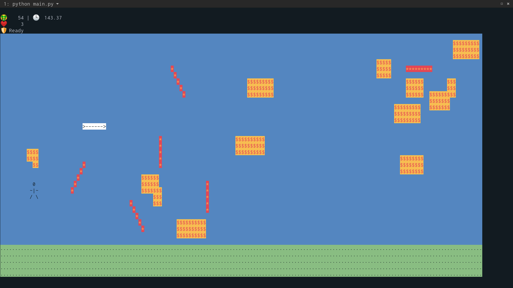
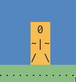
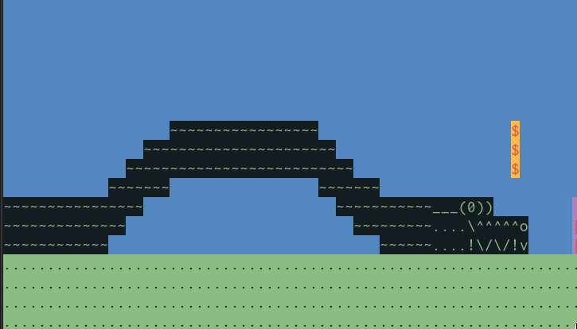
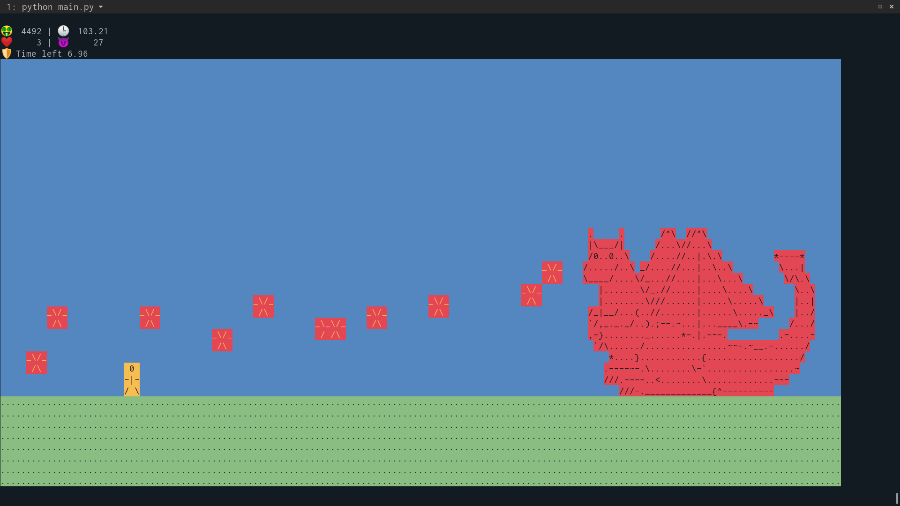
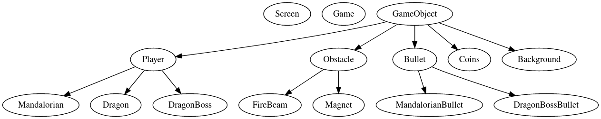

# ASCII Jetpack Joyride

## Introduction
Din is a mandalorian living in the post-empire era. He is one of the last remaining members of his clan in the galaxy and is currently on a mission for the Guild.

He needs to rescue The Child, who strikingly resembles Master Yoda, a legendary Jedi grandmaster. But there are lots of enemies and obstacles in his way, trying to prevent Din from saving Baby Yoda.

Din is wearing classic mandalorian armour and has a jetpack as well as a blaster with unlimited bullets. You’ve got to help him fight his way through.

## Setup
Ensure that you have python3.6+ and pip.

```sh
pip install -r requirements.txt
```

Run the following to play the game
```sh
python3 main.py
```

## How to play?

### Controls
 - `W` for up
 - `A` for left
 - `D` for right
 - `E` to shoot
 - `F` to activate the dragon
 - `<Space>` to activate shield
 - `S` to activate speed boost powerdown
 - `Q` to quit

### Gameplay
Collect coins, destroy firebeams to increase your score. Beware of the mighty magnet which pulls you with an enormous force.

Press `E` to shoot bullets, `F` to summon the great wriggly dragon onto this world, `<Space>` to activate the shield which will make you invincible for a limited duration (and will also make you glow).

To face the enemy, you must prove your worth by gaining enough points.

## Screens

### Sample gameplay


### Shield


### Drogon


### Boss fight


## Required components

### OOP
 - Inheritance: plz see class structure below
 - Polymorphism: the `update` method is different for coins, obstacles, etc + many other examples
 - Encapsulation: comes for free
 - Abstraction: `move()`, `shoot()`, `update()`, ..

#### Class structure


### Movement


### Background/scenery
 - We have a ground and a sky, and oh, a Millenium Falcon passes by if you are lucky.

### Obstacles: FireBeam and Magnet


### Boss Enemy


### Score and lives


### Power-ups: Shield and speed boost


### Drogon


### Color

